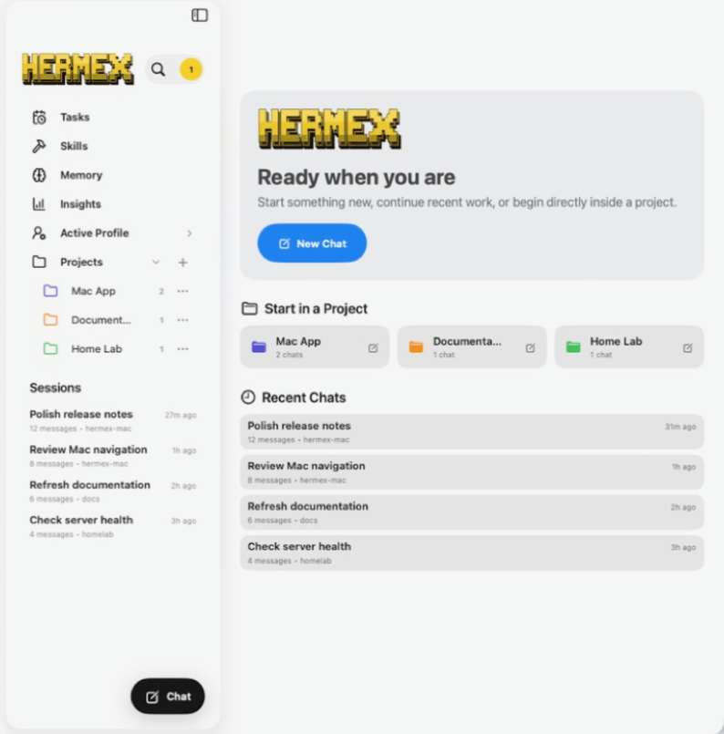
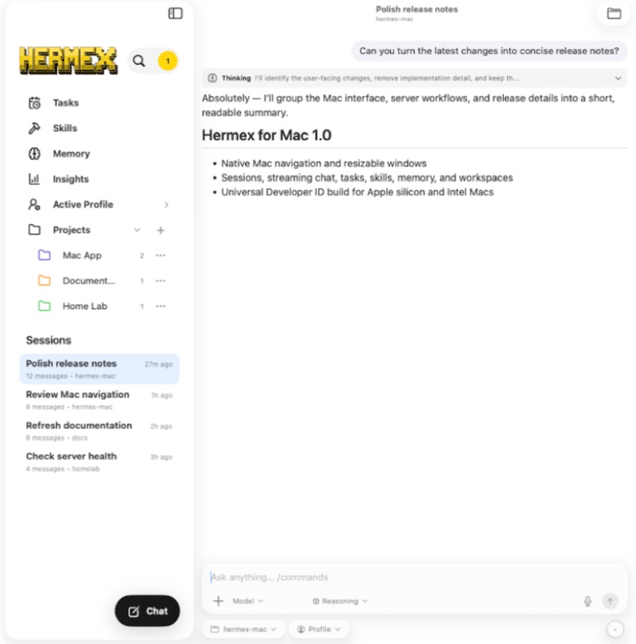
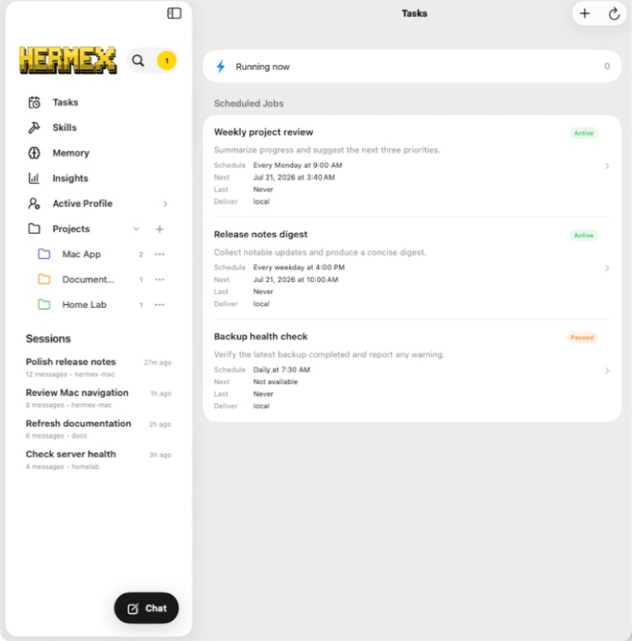
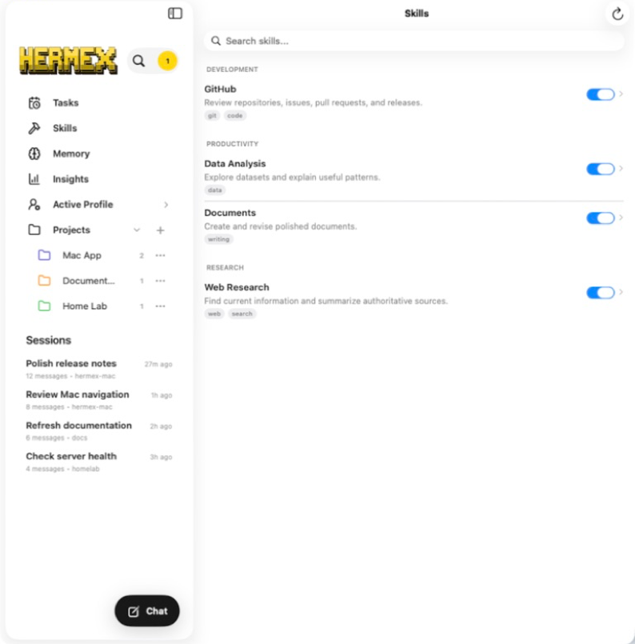

<div align="center">


# Hermex for Mac

**Control your self-hosted [Hermes](https://github.com/nesquena/hermes-webui) agent from a native Mac app.**

Your server. Your Mac. No middleman.

[](DEVELOPMENT.md#mac-catalyst-validation-and-developer-id-release)
[](https://github.com/anthonyarmijo/hermex-mac/releases/latest)
[](https://swift.org)
[](https://github.com/anthonyarmijo/hermex-mac/releases/latest)
[](LICENSE)

### [Download for macOS](https://github.com/anthonyarmijo/hermex-mac/releases/latest)

[Releases](https://github.com/anthonyarmijo/hermex-mac/releases) · [Report a bug](https://github.com/anthonyarmijo/hermex-mac/issues) · [Contributing](CONTRIBUTING.md) · [Upstream Hermex](https://github.com/uzairansaruzi/hermex)



</div>

Hermex for Mac is the macOS-focused fork of [Hermex](https://github.com/uzairansaruzi/hermex), adapted from its native iPhone experience into a daily-driver Mac interface. It connects directly to a self-hosted [hermes-webui](https://github.com/nesquena/hermes-webui) server running on hardware **you** control. The app is the control plane, not the compute plane: your agent, tools, and data stay on your server.

- **Free and open source.** No subscription or in-app purchase.
- **Private by design.** No analytics, tracking, hosted relay, or vendor account.
- **Made for the Mac.** SwiftUI through Mac Catalyst, with resizable windows, keyboard commands, native menus, pointer interactions, and a separate Settings window.

## Features

- **Chat with your agent** using model, reasoning-effort, workspace, project, and profile options; attach files and images; follow streaming responses, thinking, and tool calls in real time.
- **Steer or stop active work** without leaving the conversation.
- **Browse every session** with search, project grouping, cached offline reading, archive and rename actions, and fast Mac sidebar navigation.
- **Start in context** from a profile or project and keep per-session drafts between launches.
- **Manage scheduled tasks** and inspect the server's installed skills.
- **Browse workspaces** and preview files returned by your agent.
- **Review memory and insights** without moving private data through another service.

<div align="center">
<table>
  <tr>
    <td align="center"><br /><sub><b>Stream rich agent conversations</b></sub></td>
    <td align="center"><br /><sub><b>Manage scheduled tasks</b></sub></td>
    <td align="center"><br /><sub><b>Browse installed skills</b></sub></td>
  </tr>
</table>
</div>

## Getting started

Hermex is a client only. It does not host or provision an agent server.

1. **Run the backend.** Install and start [hermes-webui](https://github.com/nesquena/hermes-webui) on macOS, Linux, or Windows/WSL2, and set a strong `HERMES_WEBUI_PASSWORD`.
2. **Download Hermex.** Open the [latest Mac release](https://github.com/anthonyarmijo/hermex-mac/releases/latest), download the universal DMG, and verify it with the attached SHA-256 file if desired.
3. **Install.** Open the DMG and drag **Hermex** to **Applications**. Releases are signed with Developer ID and notarized by Apple.
4. **Connect.** Launch Hermex, enter your server URL and password, and complete the connection test.

Version 1.0 uses manual updates: download a newer DMG from GitHub Releases when one is published.

### Requirements

- macOS 15 Sequoia or newer on an Apple silicon or Intel Mac.
- A reachable, password-protected `hermes-webui` server. Hermex does not include the server, model provider credentials, or a hosted account.
- Network access from the Mac to the server. Localhost, HTTPS, and private Tailscale addresses are supported; arbitrary clear-text HTTP hosts are intentionally rejected.

The universal DMG contains both `arm64` and `x86_64` code. GitHub Releases is the only official update channel for this fork: there is no built-in updater and no Mac App Store version.

### Making the server reachable

- **Same Mac.** If `hermes-webui` runs locally, connect to `http://localhost:8787`.
- **HTTPS tunnel or reverse proxy (recommended remotely).** Terminate real TLS at a hostname you control. On a publicly reachable hostname, the Hermes password is the app-level defense—use a strong one.
- **Tailscale.** Connect through a tailnet address in `100.64.0.0/10`; Hermex permits plain HTTP only for that range and localhost.

Self-hosting, securing, updating, and keeping the server online remain your responsibility. If a connection test fails, confirm the server machine is awake, `/health` responds, the tunnel or Tailscale route is active, and the URL and password are correct.

### Privacy and credentials

Hermex sends requests directly from the app to the server URL you configure. It does not proxy conversations through this repository or the Mac fork maintainer. The server password is stored in the macOS Keychain, while session metadata and drafts may be cached locally to make the interface responsive and useful when the server is temporarily unavailable.

Treat a remotely reachable server like any other private service: prefer HTTPS or Tailscale, choose a unique password, keep `hermes-webui` updated, and avoid exposing its port directly to the public internet. See [`SECURITY.md`](SECURITY.md) for reporting a vulnerability in the Mac client.

## Building from source

Building requires Xcode 26 or newer. Clone the repository, open `HermesMobile.xcodeproj`, select the `HermesMobile` scheme and **My Mac (Mac Catalyst)**, then run. Swift Package Manager resolves the locked dependencies automatically.

From the command line:

```zsh
xcodebuild -project HermesMobile.xcodeproj -scheme HermesMobile \
  -destination 'platform=macOS,arch=arm64,variant=Mac Catalyst' build
```

```zsh
xcodebuild test -project HermesMobile.xcodeproj -scheme HermesMobile \
  -destination 'platform=macOS,arch=arm64,variant=Mac Catalyst' \
  -enableCodeCoverage NO
```

The shared iPhone target remains buildable so upstream changes can be integrated and validated, but this fork's public distribution and product focus are macOS. See [`DEVELOPMENT.md`](DEVELOPMENT.md) for full validation, signing, notarization, and DMG workflows.

Source builds use your own Apple Development identity and provisioning profile. Official GitHub Release artifacts are built from a `mac-vX.Y.Z` tag on `master`, signed with this fork's Developer ID identity, notarized and stapled, then uploaded to a draft release for a final manual Gatekeeper smoke test before publication.

## Server compatibility

Hermex is tested against the `hermes-webui` commit pinned in [`UPSTREAM_TESTED_SHA`](UPSTREAM_TESTED_SHA). The server does not yet guarantee API stability, so newer or older revisions can break individual features. Include the server version in bug reports.

Models decode tolerantly and ignore unknown fields. Endpoint paths and payloads are verified against a running server, official documentation, or pinned upstream source rather than invented; [`CONTRACT_TESTS.md`](CONTRACT_TESTS.md) describes the policy.

The Mac client follows upstream Hermex where shared behavior remains useful, but it can trail new server endpoints or upstream UI work while those changes are integrated and tested on both platforms. Check the changelog and open issues before reporting behavior that differs from the iPhone client.

## Documentation

- [`PROJECT_SPEC.md`](PROJECT_SPEC.md): product scope, API behavior, dependencies, and architecture decisions.
- [`PROJECT_INTENT.md`](PROJECT_INTENT.md): short product orientation and tradeoff guide.
- [`DEVELOPMENT.md`](DEVELOPMENT.md): development workflow and Mac release runbook.
- [`CONTRACT_TESTS.md`](CONTRACT_TESTS.md): server contract verification and pin-advance policy.
- [`SECURITY.md`](SECURITY.md): private vulnerability-reporting instructions.
- [GitHub Issues](https://github.com/anthonyarmijo/hermex-mac/issues): bugs, Mac polish, and feature requests.

## Contributing

Contributions are welcome. Start with [`CONTRIBUTING.md`](CONTRIBUTING.md), follow the agent working agreement in [`AGENTS.md`](AGENTS.md), and observe the [Code of Conduct](CODE_OF_CONDUCT.md).

- Verify server contracts instead of guessing endpoints or JSON.
- Keep every upstream-controlled `Codable` field tolerant of missing or renamed data.
- Add no third-party dependency without explicit approval.
- Validate shared changes on both Mac Catalyst and the reference iPhone simulator.

## Credits

This project is a fork of [Hermex](https://github.com/uzairansaruzi/hermex), created and maintained upstream by [Uzair Ansar](https://github.com/uzairansaruzi). The Mac fork retains the original MIT license and upstream history while maintaining its own Mac interface, signing identity, release process, issue tracker, and downloadable artifacts.

Hermex and this fork are independent clients for the third-party [hermes-webui](https://github.com/nesquena/hermes-webui) project and are not affiliated with it.

## License

MIT — see [LICENSE](LICENSE). Apple, macOS, and the Apple logo are trademarks of Apple Inc.
